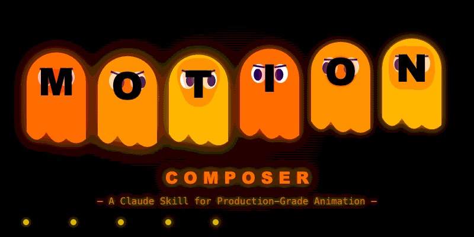

<div align="center">



# motion-composer-skill

**A Claude skill for cinematic product video direction and production-grade motion design.**

[](LICENSE)
[](https://github.com/designbysuren/motion-composer-skill)
[](SKILL.md)

</div>

---

## What This Skill Does

Turns Claude into a full cinematic production pipeline, not just a code helper.

Claude operates as a Creative Director, Motion Designer, Video Editor, Cinematic Storyboard Artist, and Remotion / CapCut Orchestrator.

**Claude can:**
- Choose the right framework for every request (GSAP, Remotion, Motion Canvas, Framer Motion, or AI video)
- Apply the 12 Animation Principles translated into code patterns
- Generate production-ready animations with correct easing, timing, and performance
- Build Remotion video compositions for product demos and App Store previews
- Write ScrollTrigger scroll sequences, SVG path animations, and Three.js scenes
- Compose AI video prompts for Veo 3, Runway Gen-4, and Sora with correct compositing strategy
- Generate full cinematic storyboards with scene JSON
- Write TTS voiceover scripts with cinematic pause markers
- Output CapCut-ready editing timelines

---

## Install

**Claude Code (recommended):**

```bash
git clone https://github.com/designbysuren/motion-composer-skill ~/.claude/skills/motion-composer-skill
```

Claude will automatically detect and use the skill when relevant.

**Manual:** Copy `SKILL.md` into any `.claude/skills/` directory in your project.

---

## Usage

### Cinematic Commercial

```
Using motion-composer-skill:

Create a 90-second cinematic Vivlune launch commercial.

Generate:
- full storyboard with scene JSON
- Veo 3 prompts for each scene
- CapCut edit structure
- Edge TTS voiceover with pause markers
- UI overlay plan

Style: Apple/Oura level, emotionally restrained premium women wellness campaign
Core theme: Women quietly passing privacy and trust forward across generations.
```

### Code Animation

```
Build a scroll-triggered reveal animation for a landing page hero section.
Use the motion-composer skill.
```

```
Create a Remotion composition for a 30-second product demo video at 1920x1080.
Use the motion-composer skill.
```

```
Write a Veo 3 prompt to generate a cinematic product launch video.
Use the motion-composer skill.
```

---

## Execution Modes

| Mode | Purpose |
|------|---------|
| `commercial_mode` | Apple / Oura-style premium product ads |
| `story_mode` | Emotional narrative campaigns |
| `walkthrough_mode` | Product feature walkthroughs |
| `hook_mode` | Viral intro / first-3-second hooks |
| `veo_mode` | AI video generation prompts (Veo 3, Runway, Sora) |
| `capcut_mode` | CapCut editing timeline plans |
| `tts_mode` | Edge TTS voiceover pacing and script |
| `code_mode` | GSAP, Remotion, Motion Canvas, ScrollTrigger code |

---

## Decision Tree

```
User wants...                                Tool
---------------------------------------------------------------------
Cinematic product commercial / brand film    commercial_mode
Looping web animation / micro-interaction    GSAP + HTML/CSS
SVG path drawing or morphing                 GSAP DrawSVG / CSS stroke
Programmatic video / MP4 export              Remotion
After Effects-style scene (imperative)       Motion Canvas
Scroll-triggered storytelling / parallax     GSAP ScrollTrigger
Particle systems / generative motion         Canvas / Three.js / p5.js
AI-generated video                           Veo 3 / Runway / Sora API
```

---

## Scene JSON Output

Every commercial scene gets structured JSON:

```json
{
  "scene": 1,
  "duration": 8,
  "goal": "hook",
  "visual": "teenage girl near beach looking at phone",
  "camera": "slow push-in",
  "voiceover": "Every woman tracks something personal",
  "ambient_audio": "ocean waves",
  "overlay": "none",
  "editing_style": "slow cinematic tension"
}
```

---

## Timing Reference

| Feel | Duration | Easing |
|------|----------|--------|
| Snappy | 100-200ms | `power3.out` |
| UI / interactive | 200-350ms | `power2.inOut` |
| Page transition | 400-600ms | `expo.out` |
| Cinematic | 800ms-1.5s | `power1.inOut` |
| Ambient loop | 2s-8s | `sine.inOut` |

---

## Repo Structure

```
motion-composer-skill/
SKILL.md                               the brain Claude reads
references/
  gsap.md                              Full GSAP API, plugins, patterns
  remotion.md                          Remotion compositions, hooks, Player
  motion-canvas.md                     Motion Canvas scenes, signals, camera
  framer-scrolltrigger-svg-canvas.md   Framer, ScrollTrigger, SVG, Three.js, p5
  ai-video-apis.md                     Veo 3, Runway Gen-4, Sora API calls
motion-composer.gif                    animated banner
README.md
LICENSE
```

---

## Using with Other Agents

**Cursor** -- add to `.cursorrules`:
```
For any animation, motion graphics, video composition, or cinematic storyboard
requests, apply the motion-composer skill. Reference SKILL.md for the decision
tree, execution modes, and patterns.
```

**Codex CLI / Opencode** -- add to `AGENTS.md`:
```
For animations, motion graphics, videos, GSAP, Remotion, ScrollTrigger,
cinematic storyboards, or AI video prompt requests, apply the rules in
SKILL.md (motion-composer skill).
```

**ChatGPT / API** -- paste `SKILL.md` contents into the system prompt.

---

Built with love by [designbysuren](https://github.com/designbysuren) - MIT License
